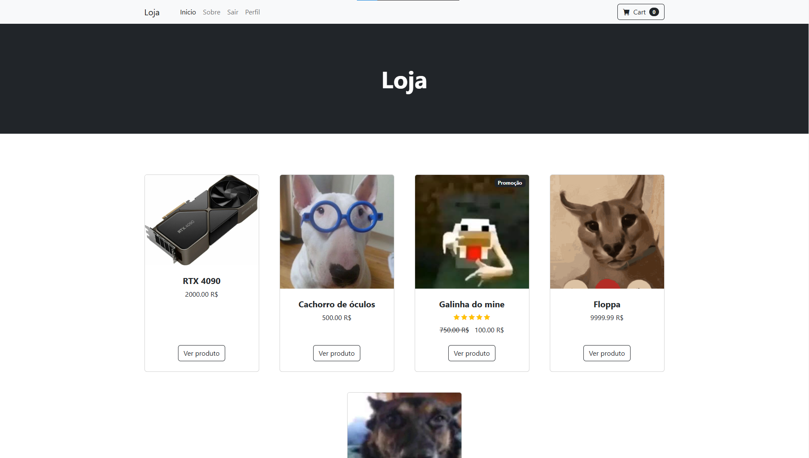

# Projeto Web Django - Tema 9

### Avaliação final - Programação para Web
### Aluno: Gustavo de Souza Andrade

  
  
<em>Imagem do projeto avaliação final</em>

## Funcionalidades
- Criação de User
- Entrar com o User
- Ver produto
- Comprar produto
- Avaliar produto
